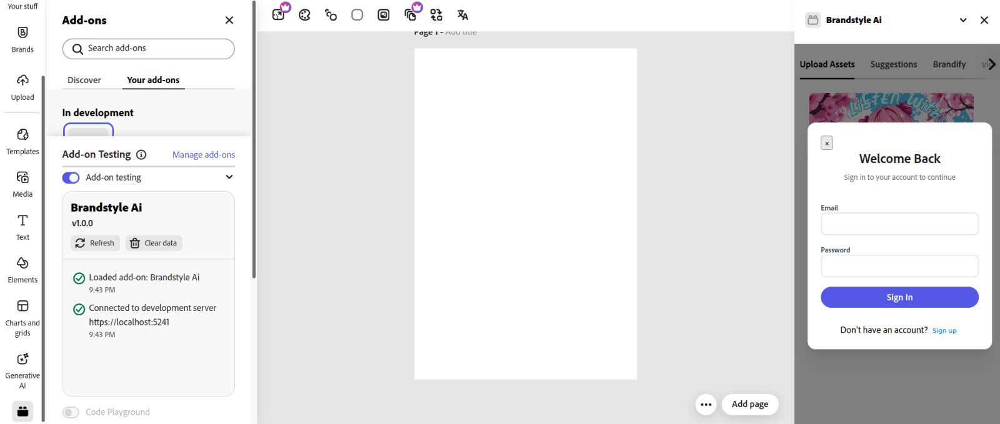

# BrandstyleAI

BrandstyleAI is an AI-powered design assistant that brings instant, consistent branding to everyone in Adobe Express. Upload a logo, screenshot, or website URL—BrandstyleAI extracts your brand’s DNA (colors, fonts, logos, style cues) and applies it across documents in a single click. Fast, private, and future-ready.

---

## 🚀 Inspiration

We saw how creative teams and solo founders struggle to build consistent branding across docs, decks, and campaigns. Manual extraction of colors, fonts, and styles is slow and error-prone. We set out to automate the boring parts, so creators can focus on vision, not formatting.

---

## 🧠 What it does

- Extracts colors, fonts, and logo from images, PDFs, and URLs using deep learning, web scraping, and clustering.
- Uses Gemini API (RAG) for advanced style and font inference from web sources and noisy screenshots.
- Provides live “brand DNA” preview and lets users manually refine or save their brand.
- Brandifies any Adobe Express document with your extracted brand (via Document API).
- Offers quick “one-click” branding for PDFs, Word, and PowerPoint files.
- All processing happens in-browser or via secure FastAPI backend—privacy by default.
- Stores your brands, suggestions, and history in Supabase for instant reuse.
- (MVP) Recommends color palettes using k-means clustering and Gemini-powered Copilot prompts.

---

## 🛠️ How we built it

- **Frontend:** React, JavaScript, Adobe Spectrum Web Components, Express Add-ons SDK.
- **Backend:** FastAPI for extraction endpoints, Selenium for web scraping, Supabase for authentication/brand storage.
- **AI & ML:** Gemini API (RAG) for intelligent font/style retrieval, k-means for color palette extraction.
- **Automation:** Selenium scripts crawl websites to fetch logos, color cues, and font files.
- **Integration:** Adobe Express Document API for real-time document styling.

---

## 🏆 Accomplishments

- Extracts usable brand DNA from nearly any input (even complex homepages or noisy images).
- Seamless “Brandify” workflow in Adobe Express.
- Real-time privacy: no files are stored or processed server-side unless needed for extraction.
- Copilot-style recommendations and live brand previews.

---

## 💡 What we learned

- How to push FastAPI and Selenium for robust, resilient web scraping.
- Integrating Gemini RAG and k-means for real-world creative tasks.
- Mastered Adobe Express’s new Document API and SDK.
- Built a fully cloudless, privacy-first design workflow.

---

## 🚦 What's next for BrandstyleAI

- **Video branding:** Instantly generate branded intros/outros for videos, reels, and stories.
- **Copilot expansion:** Smart, chat-driven brand suggestions, on-brand content rewrites, and full “create from description” flows.
- **Real-time feedback:** Copilot advises on color, accessibility, and logo usage as you work.
- **Team collaboration:** Share brand DNA across teams; manage multiple brands.
- **More formats:** Export branded assets to even more formats and integrations.

---

## 📸 Screenshots

All images are in the `demo-pictures/` folder of this repo.

### 1. Creating a brand manually

### 2. Extract DNA From picture

### 3. Extract

### 4. Extracted Brand DNA

### 5. Login/Signup

### 6. Manually created Brand

### 7. Preview of extract (need to login)
.jpeg)

### 8. Recommended colors (co-pilot reference from video)
.jpeg)

### 9. Saved brands

### 10. Suggestions page

---

## 🛠️ Built With

- **FastAPI** (backend, API)
- **Adobe Express SDK** (Document API)
- **K-means Clustering** (palette extraction)
- **Selenium** (web scraping)
- **React + JavaScript** (frontend)
- **Supabase** (auth, storage)
- **Gemini API (RAG)** (font/style retrieval, AI suggestions)

---

## 📝 License

Apache 2.0, see [LICENSE](LICENSE).